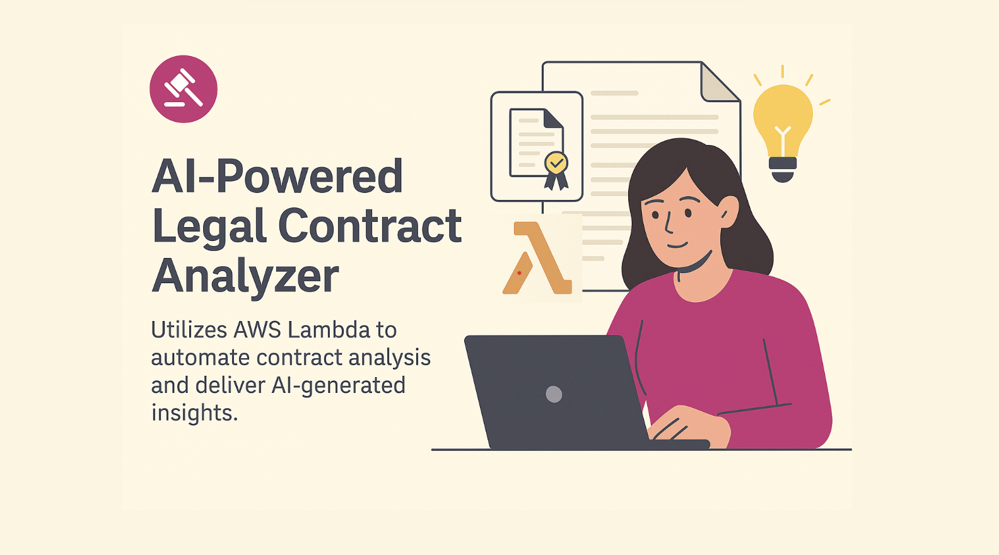

## ⚙️ Project Setup

---

```markdown
# 🧾 Legal Contract Analyzer powered by AWS lambda

The **Legal Contract Analyzer** is a full-stack AI-powered platform that automates the extraction, analysis, and summarization of legal contracts. Utilizing AWS services and advanced AI via the Google Gemini API, this tool provides smart insights and structured understanding from uploaded documents.

AWS Lambda is at the heart of this project, enabling fully automated, scalable, and cost-effective legal analysis without managing servers.
💡 How Lambda powers this project:
Whenever a PDF contract is uploaded to S3, an S3 trigger invokes the Lambda function automatically.
Lambda runs a Python script that:
Uses AWS Textract to extract all text from the PDF.
Calls AWS Comprehend to analyze key entities and phrases.
Integrates with Google Gemini API to summarize legal clauses and risks.
Finally, Lambda generates a detailed analysis report and saves it back to the S3 bucket for frontend retrieval.

 

---

## 🚀 Features

- 🖥️ Clean React front-end interface
- 🔧 Express.js backend for API handling
- ☁️ File storage and trigger system using AWS S3
- ⚙️ Serverless compute with **AWS Lambda**
- 📄 Document parsing with **AWS Textract**
- 🧠 Entity recognition and sentiment analysis via **AWS Comprehend**
- 🤖 Advanced legal reasoning through **Google Gemini API**
- ⚡ Optimized front-end tooling with **Vite**

---

## 🧩 System Architecture Overview

```
User → React App → Express Backend → AWS S3 → 
→ Lambda → Textract → Comprehend → Google APMI → Gemini API
```

---

## 🛠 Tech Stack

| Layer       | Technology                   |
|-------------|-------------------------------|
| Frontend    | React, Vite                   |
| Backend     | Node.js, Express              |
| Cloud       | AWS Lambda, AWS S3            |
| AI/NLP      | AWS Textract, AWS Comprehend  |
| AI Analysis | Google Gemini API             |
| Integration | Google APMI                   |

---

## ⚙️ Getting Started

Follow these steps to set up the **Frontend**, **Backend**, and **AWS Lambda Function**.

### 🔁 1. Clone Repository

```bash
git clone https://github.com/YOUR_USERNAME/legal-contract-analyzer.git
cd legal-contract-analyzer
```

---

### 💻 2. Setup Frontend

```bash
cd frontend
npm install
npm run dev
```

This starts the React app using **Vite**. The app should be available at `http://localhost:3000`.

---

### 🔧 3. Setup Backend

```bash
cd ../backend
npm install
node server.js
```

Create a `.env` file inside the `backend` directory with the following content:

```
AWS_ACCESS_KEY_ID=YOUR_ACCESS_KEY
AWS_SECRET_ACCESS_KEY=YOUR_SECRET_KEY
```

> ✅ Ensure these credentials have access to S3, Textract, and Comprehend.

---

### ☁️ 4. Deploy AWS Lambda Function

1. Go to the **AWS Lambda Console**.
2. Click **Create function**.
3. Choose **Author from scratch**.
4. Use the code from:

   ```
   lambda/lambda_function.py
   ```

5. Set **Environment Variable**:

   | Key             | Value                |
   |------------------|----------------------|
   | `GEMINI_API_KEY` | your Gemini API key  |

6. Attach the following **IAM Policies**:
   - `AmazonTextractFullAccess`
   - `ComprehendFullAccess`
   - `AmazonS3FullAccess`

7. **Set Trigger from S3**:
   - Trigger type: **S3**
   - Bucket: your designated bucket
   - Prefix: `uploads/`

---

## 📂 Folder Structure

```
legal-contract-analyzer/
│
├── frontend/           # React + Vite front-end
├── backend/            # Express server
├── lambda/             # Lambda function code
└── README.md           # You're here!
```

---

## 📌 TODOs & Future Enhancements

- 🧾 Clause-level classification and summarization
- 🌐 Multilingual document support
- 🔐 Secure authentication & role-based access
- 📊 Visual contract insights and dashboards

---

## 🤝 Contributing

Contributions are welcome! Feel free to fork this repo, create a branch, and submit a pull request.

---

## 📄 License

This project is licensed under the [MIT License](LICENSE).

---

## 🙌 Acknowledgements

- [AWS](https://aws.amazon.com/)
- [Google Gemini](https://deepmind.google/technologies/gemini/)
- [React](https://reactjs.org/)
- [Vite](https://vitejs.dev/)
- [Express.js](https://expressjs.com/)

---

```


